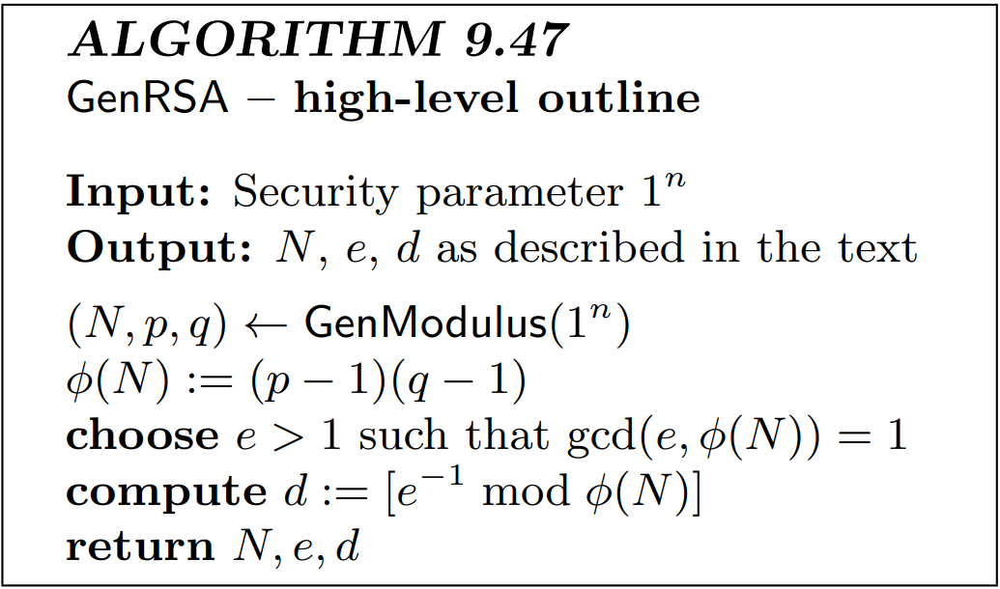
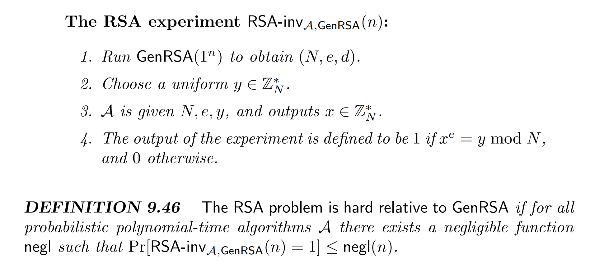

# 문제 9.27 : RSA 가정과 충돌 저항성 해시

9.27번 문제("RSA 문제가 어렵다면, 구성 9.80의 해시 함수 H는 충돌 저항성을 가짐을 증명하라")를 풀기 위해,   
9.2.4절의 "RSA 가정"을 어떻게 활용하는지 설명합니다.

---

## 1. 먼저 RSA 문제란?

먼저 `GenRSA` 알고리즘 (Algorithm 9.47)은 다음 세 가지를 생성합니다.

1.  **$N$**: 두 개의 큰 소수 $p, q$의 곱 ($N = pq$)

2.  **$e$**: $\gcd(e, \phi(N)) = 1$을 만족하는 공개 지수 (이때 $\phi(N) = (p-1)(q-1)$)

3.  **$d$**: $ed \equiv 1 \pmod{\phi(N)}$을 만족하는 비밀 지수

RSA 암호 체계의 핵심은 **계산의 비대칭성**에 있습니다.

* **쉬운 계산 (공개키):** $N$과 $e$를 아는 사람은 누구나 $x^e \pmod N$ (즉, $y$)를 쉽게 계산할 수 있습니다.

* **어려운 계산 (문제):** $N, e, y$가 주어졌을 때, $y$의 $e$-제곱근(e-th root)인 $x$를 찾는 것은 **매우 어렵습니다.**

> x를 찾을려면, 비밀키 d 필요, d를 찾을려면 파이 N이 필요 -> 근데 N 을 p,q 로 소인수 분해? 미친짓

* **쉬운 역 계산 (비밀키):** 비밀키 $d$를 아는 사람은 $y^d \pmod N$을 계산하여 $x$를 매우 쉽게 찾을 수 있습니다. ($y^d \equiv (x^e)^d \equiv x \pmod N$)

> **"RSA 문제" (The RSA Problem)란?**
> 비밀 정보($p, q$ 또는 $d$)가 없는 상태에서, 공개된 값 $(N, e, y)$만을 가지고 $x^e \equiv y \pmod N$을 만족하는 $x$를 찾는 계산 문제입니다.

---

## 2. "RSA 문제가 어렵다"의 공식 정의 (Def 9.46)

"어렵다"는 것을 증명에 사용하기 위해, "얼마나 어려운가"를 **RSA 가정, The RSA Assumption**으로 수학적으로 정의합니다. 이는 "RSA-inv"라는 **실험**을 통해 정의됩니다.

### The RSA-inv 실험

이 실험은 어떤 "공격자" 알고리즘 $\mathcal{A}$가 RSA 문제를 얼마나 잘 푸는지 테스트합니다.

1.  **준비 (GenRSA):** `GenRSA(1^n)`를 실행해서 $(N, e, d)$를 생성합니다.

2.  **문제 출제:** $\mathbb{Z}_N^*$에서 임의의 $y$를 하나 선택합니다.

3.  **공격 (Adversary $\mathcal{A}$):** 공격자 $\mathcal{A}$에게 $(N, e, y)$를 줍니다. (비밀 $d$는 주지 않습니다.)

4.  **답안 제출:** $\mathcal{A}$는 $(N, e, y)$를 보고 정답 $x$를 추측하여 제출합니다.

5.  **채점:** $\mathcal{A}$가 제출한 $x$에 대해 $x^e \equiv y \pmod N$이 맞으면 **성공(1)**, 틀리면 **실패(0)**입니다.

---

### "어렵다"의 정의 (Definition 9.46)

> **RSA 문제가 어렵다**는 것은, **어떤** 효율적인(probabilistic polynomial-time, P.P.T.) 공격자 $\mathcal{A}$가 위 실험에서 **성공할 확률**($\Pr[\text{RSA-inv}_{\mathcal{A}, \text{GenRSA}}(n) = 1]$)이 **negligible**하다는 뜻입니다.

* **$\mathsf{PPT}$** : 현실적인 시간(다항 시간) 안에 답을 내는 알고리즘.
* **무시 가능** : $n$ (보안 파라미터)이 커짐에 따라 성공 확률이 $1/2^n$처럼 사실상 0에 가깝게 매우 빠르게 줄어드는 확률을 의미.

즉, **사실상 그 어떤 현실적인 공격자도 RSA 문제를 의미 있는 확률로 풀 수 없다**는 것이 바로 'RSA 가정'입니다.

---

## 3. 문제 9.27, Reduction

이제 이 RSA 가정을 9.27번 문제에 적용합니다.

**증명할 것:** 만약 **RSA 문제가 어렵다면** (가정 1), **Construction 9.80의 해시 함수 $H$는 충돌 저항성을 가진다** (결론 1).

이런 명제는 **$Contrapositive$ 를 이용한 귀류법, $Reduction$**으로 증명합니다.

> **증명 target (대우):**
> "만약 **$H$의 충돌을 *쉽게* 찾을 수 있다면** (결론 1의 부정),
> **RSA 문제를 *쉽게* 풀 수 있다** (가정 1의 부정)."

이것을 증명하면, "RSA 문제가 어렵다"는 대전제 하에서 "H의 충돌을 쉽게 찾는 것"은 모순이 되므로, "H의 충돌을 찾는 것은 어렵다"는 결론이 나옵니다.

### prove

"H의 충돌을 쉽게 찾는" 가상의 효율적인 공격자 $\mathcal{C}$ (Collision-Finder)가 존재한다고 **가정**한다.

우리는 이 $\mathcal{C}$를 '부품'으로 사용하여 "RSA 문제를 푸는" 효율적인 공격자 $\mathcal{A}$ (RSA-Solver)를 **만들 것입니다.**

1.  우리 $\mathcal{A}$는 RSA 문제 챌린지 $(N, e, y)$를 받습니다. (우리의 목표: $x^e \equiv y \pmod N$인 $x$ 찾기)

4.  $\mathcal{A}$는 이 챌린지 $(N, e, y)$를 그대로 해시 함수의 키 $s$로 설정합니다. 즉, $s := (N, e, y)$로 정합니다.

5.  $\mathcal{A}$는 이 $s$를 부품 $\mathcal{C}$에게 입력합니다.

6.  $\mathcal{C}$는 (가정에 의해) 효율적으로 $H^s(x) = H^s(x')$을 만족하는 $x \neq x'$ 충돌 쌍을 찾아냅니다.

7.  $\mathcal{A}$는 이 충돌 쌍 $(x, x')$을 분석합니다. $H^s(x)$의 정의는 다음과 같습니다.
    * $f_0(z)=z^e \pmod N$
    * $f_1(z)=y \cdot z^e \pmod N$
    * $H^s(x) = f_{x_1}(f_{x_2}(\dots f_{x_{3n}}(1) \dots))$

8.  이 함수를 전개를 해야되는데