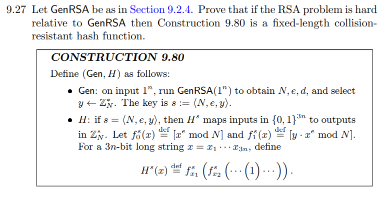

# 문제 9.27 : RSA 가정과 충돌 저항성 해시

9.27번 문제("RSA 문제가 어렵다면, 구성 9.80의 해시 함수 H는 충돌 저항성을 가짐을 증명하라")를 풀기 위해,   
9.2.4절의 "RSA 가정"을 어떻게 활용하는지 설명합니다.

---

## 1. 먼저 RSA 문제란?

먼저 `GenRSA` 알고리즘 (Algorithm 9.47)은 다음 세 가지를 생성합니다.

1.  **$N$**: 두 개의 큰 소수 $p, q$의 곱 ($N = pq$)

2.  **$e$**: $\gcd(e, \phi(N)) = 1$을 만족하는 공개 지수 (이때 $\phi(N) = (p-1)(q-1)$)

3.  **$d$**: $ed \equiv 1 \pmod{\phi(N)}$을 만족하는 비밀 지수

RSA 암호 체계의 핵심은 **계산의 비대칭성**에 있습니다.

* **쉬운 계산 (공개키):** $N$과 $e$를 아는 사람은 누구나 $x^e \pmod N$ (즉, $y$)를 쉽게 계산할 수 있습니다.

* **어려운 계산 (문제):** $N, e, y$가 주어졌을 때, $y$의 $e$-제곱근(e-th root)인 $x$를 찾는 것은 **매우 어렵습니다.**

* **쉬운 역 계산 (비밀키):** 비밀키 $d$를 아는 사람은 $y^d \pmod N$을 계산하여 $x$를 매우 쉽게 찾을 수 있습니다. ($y^d \equiv (x^e)^d \equiv x \pmod N$)

> **"RSA 문제" (The RSA Problem)란?**
> 비밀 정보($p, q$ 또는 $d$)가 없는 상태에서, 공개된 값 $(N, e, y)$만을 가지고 $x^e \equiv y \pmod N$을 만족하는 $x$를 찾는 계산 문제입니다.

---

## 2. "RSA 문제가 어렵다"의 공식 정의 (Def 9.46)

"어렵다"는 것을 증명에 사용하기 위해, "얼마나 어려운가"를 **RSA 가정, The RSA Assumption**으로 수학적으로 정의합니다. 이는 "RSA-inv"라는 **실험**을 통해 정의됩니다.

### The RSA-inv 실험

이 실험은 어떤 "공격자" 알고리즘 $\mathcal{A}$가 RSA 문제를 얼마나 잘 푸는지 테스트합니다.

1.  **준비 (GenRSA):** `GenRSA(1^n)`를 실행해서 $(N, e, d)$를 생성합니다.

2.  **문제 출제:** $\mathbb{Z}_N^*$에서 임의의 $y$를 하나 선택합니다.

3.  **공격 (Adversary $\mathcal{A}$):** 공격자 $\mathcal{A}$에게 $(N, e, y)$를 줍니다. (비밀 $d$는 주지 않습니다.)

4.  **답안 제출:** $\mathcal{A}$는 $(N, e, y)$를 보고 정답 $x$를 추측하여 제출합니다.

5.  **채점:** $\mathcal{A}$가 제출한 $x$에 대해 $x^e \equiv y \pmod N$이 맞으면 **성공(1)**, 틀리면 **실패(0)**입니다.

---

### "어렵다"의 정의 (Definition 9.46)

> **RSA 문제가 어렵다**는 것은, **어떤** 효율적인(probabilistic polynomial-time, P.P.T.) 공격자 $\mathcal{A}$가 위 실험에서 **성공할 확률**($\Pr[\text{RSA-inv}_{\mathcal{A}, \text{GenRSA}}(n) = 1]$)이 **negligible**하다는 뜻입니다.

* **$\mathsf{PPT}$** : 현실적인 시간(다항 시간) 안에 답을 내는 알고리즘.
* **무시 가능** : $n$ (보안 파라미터)이 커짐에 따라 성공 확률이 $1/2^n$처럼 사실상 0에 가깝게 매우 빠르게 줄어드는 확률을 의미.

즉, **사실상 그 어떤 현실적인 공격자도 RSA 문제를 의미 있는 확률로 풀 수 없다**는 것이 바로 'RSA 가정'입니다.

---

## 3. 문제 9.27, Reduction

이제 이 RSA 가정을 9.27번 문제에 적용합니다.

**증명할 것:** 만약 **RSA 문제가 어렵다면** (가정 1), **Construction 9.80의 해시 함수 $H$는 충돌 저항성을 가진다** (결론 1).

위 명제는 $Contrapositive$ 를 이용한 귀류법, $Reduction$으로 증명합니다.

> **증명 target (대우):**
> "만약 **$H$의 충돌을 *쉽게* 찾을 수 있다면** (결론 1의 부정),
> **RSA 문제를 *쉽게* 풀 수 있다** (가정 1의 부정)."

이것을 증명하면, "RSA 문제가 어렵다"는 대전제 하에서 "H의 충돌을 쉽게 찾는 것"은 모순이 되므로, "H의 충돌을 찾는 것은 어렵다"는 결론이 나옵니다.

### prove

---

## 1. 증명의 흐름

1.  **가정:** "H의 충돌을 쉽게 찾는" 가상의 효율적인 공격자 $\mathcal{C}$ (Collision-Finder)가 존재한다고 **가정**한다. ($\mathcal{C}$는 $s$를 받으면, $H^s(x) = H^s(x')$ 이고 $x \neq x'$ 인 $(x, x')$ 쌍을 (무시 못할 확률로) 찾아낸다.)

2.  **목표:** 우리는 이 $\mathcal{C}$를 '부품'으로 사용하여 "RSA 문제를 푸는" 효율적인 공격자 $\mathcal{A}$ (RSA-Solver)를 **만들 것이다.** ($\mathcal{C} \Rightarrow \mathcal{A}$)

3.  **$\mathcal{A}$의 시작:** $\mathcal{A}$는 RSA 문제 챌린지 $(N, e, y)$를 받는다.
    (우리의 목표: $w^e \equiv y \pmod N$ 인 $w$를 찾기)

4.  **$\mathcal{A}$의 $\mathcal{C}$ 활용:**
    * $\mathcal{A}$는 $\mathcal{C}$에게 줄 해시 키 $s$를 자신이 받은 챌린지 $(N, e, y)$로 설정한다. 즉, **$s := (N, e, y)$**
    * $\mathcal{A}$는 $\mathcal{C}(s)$를 실행시켜 충돌 쌍 $(x, x')$을 얻는다.

5.  **$\mathcal{A}$의 분석 (충돌의 의미):**
    * $\mathcal{C}$가 성공했으므로 $H^s(x) = H^s(x')$ 이다.
    * $H^s$의 정의를 (미리) 분석해보면, $H^s(x) = y^{E(x)} \pmod N$ 형태임을 알 수 있다. (여기서 $E(x)$는 $x$와 $e$로 이루어진 어떤 지수)
    * 따라서 충돌은 $y^{E(x)} \equiv y^{E(x')} \pmod N$ 을 의미한다.
    * 이는 $y^{E(x) - E(x')} \equiv 1 \pmod N$ 과 같다.

6.  **$\mathcal{A}$의 해(Solution) 도출:**
    * $K = E(x) - E(x')$ 라고 하자. $x \neq x'$ 이므로 $K \neq 0$이다.
    * $\mathcal{A}$는 이 $K$가 $e$와 서로소($\gcd(K, e) = 1$)가 되는 "좋은" 충돌이 (무시 못할 확률로) 발생하기를 기대한다.
    * 만약 "좋은" 충돌이 발생하면 ($\gcd(K, e) = 1$), $\mathcal{A}$는 $aK + be = 1$ 인 $a, b$를 (유클리드 알고리즘으로) 찾을 수 있다.
    * $\mathcal{A}$는 $y \equiv y^1 \equiv y^{aK+be} \equiv (y^K)^a \cdot (y^b)^e \equiv 1^a \cdot (y^b)^e \equiv (y^b)^e \pmod N$ 를 계산한다.
    * $\mathcal{A}$는 $w = y^b \pmod N$ 가 $y$의 $e$-제곱근임을 알아내고, $w$를 RSA 문제의 정답으로 제출한다.

7.  **결론 (모순):**
    * $\mathcal{C}$가 (무시 못할 확률로) 성공하면, $\mathcal{A}$도 (무시 못할 확률로) RSA 문제를 풀 수 있다.
    * 이는 "RSA 문제는 어렵다"는 우리의 **대 전제(RSA Assumption)에 모순**된다.
    * 따라서 $\mathcal{C}$는 존재할 수 없다. 즉, $H$는 충돌 저항성을 가진다.

---

## 2. Proof

**Proof (by Reduction):**

귀류법(Proof by contradiction)을 사용한다. $\text{Construction 9.80}$이 충돌 저항성을 갖지 **않는다**고 가정하자.

이는 보안 파라미터 $n$에 대해, $s \leftarrow \text{Gen}(1^n)$가 주어졌을 때 $H^s(x) = H^s(x')$ 이고 $x \neq x'$ 인 $x, x' \in \{0, 1\}^{3n}$ 쌍을 찾는, 확률적 다항 시간(P.P.T.) 공격자 $\mathcal{C}$가 존재한다는 의미이다. $\mathcal{C}$의 성공 확률을 $\epsilon(n)$이라 할 때, $\epsilon(n)$은 무시 가능하지 않다(non-negligible).

우리는 이 공격자 $\mathcal{C}$를 서브루틴으로 사용하여, RSA 문제를 (무시 가능하지 않은 확률로) 풀 수 있는 P.P.T. 알고리즘 $\mathcal{A}$를 구성할 것이다.

---
**알고리즘 $\mathcal{A}^{\mathcal{C}}$의 구성:**

$\mathcal{A}$는 $\text{GenRSA}(1^n)$로부터 생성된 $\text{RSA-inv}$ 챌린지 인스턴스 $(N, e, y)$를 입력으로 받는다. $\mathcal{A}$의 목표는 $w^e \equiv y \pmod N$을 만족하는 $w \in \mathbb{Z}_N^*$를 찾는 것이다.

1.  **키 설정:** $\mathcal{A}$는 해시 키 $s$를 자신이 입력받은 챌린지 $s := (N, e, y)$로 설정한다.
2.  **공격자 호출:** $\mathcal{A}$는 $\mathcal{C}(s)$를 실행하여 충돌 쌍 $(x, x')$을 얻는다. 만약 $\mathcal{C}$가 실패하거나 $x=x'$이거나 $H^s(x) \neq H^s(x')$이면, $\mathcal{A}$는 $\perp$ (실패)를 출력하고 중단한다.
3.  **해시 값 분석:** $H^s(x)$의 정의를 분석한다. $z_0 = 1$이라 하고, $z_k = f_{x_{3n-k+1}}(z_{k-1})$ (단, $k=1, \dots, 3n$)이라 하자.
     $$z_1 = f_{x_{3n}}(1) = y^{x_{3n}} \cdot 1^e = y^{x_{3n}}$$
     $$z_2 = f_{x_{3n-1}}(z_1) = y^{x_{3n-1}} \cdot (z_1)^e = y^{x_{3n-1}} \cdot (y^{x_{3n}})^e = y^{x_{3n-1} + e \cdot x_{3n}}$$
     $$...$$
     $$H^s(x) = z_{3n} = f_{x_1}(z_{3n-1}) = y^{x_1} \cdot (z_{3n-1})^e = y^{x_1 + e \cdot x_2 + \dots + e^{3n-1} \cdot x_{3n}}$$
    $$이때 \ 지수를 \ E(x) \overset{\text{def}}{=} \sum_{i=1}^{3n} x_i e^{i-1}$$ 라고 정의하면, $$H^s(x) \equiv y^{E(x)} \pmod N$$ 이다.
4.  **충돌 분석:** $\mathcal{C}$가 찾은 충돌은 $H^s(x) \equiv H^s(x')$ 이므로, $y^{E(x)} \equiv y^{E(x')} \pmod N$ 이다.
    이는 $y^{E(x) - E(x')} \equiv 1 \pmod N$ 을 의미한다.
    
    $K \overset{\text{def}}{=} E(x) - E(x') = \sum_{i=1}^{3n} (x_i - x'_i) e^{i-1}$   
    로 정의하자. $x \neq x'$이므로 $K \neq 0$이다.
5.  **해(Solution) 추출:**
    $j$를 $x_j \neq x'_j$를 만족하는 가장 작은 인덱스($1 \le j \le 3n$)라 하자.
    $$K = \sum_{i=j}^{3n} (x_i - x'_i) e^{i-1} = e^{j-1} \sum_{i=j}^{3n} (x_i - x'_i) e^{i-j}$$
    $$K = e^{j-1} \cdot \left[ (x_j - x'_j) + e \cdot (x_{j+1} - x'_{j+1}) + \dots \right]$$
    $K' \overset{\text{def}}{=} K / e^{j-1}$ 로 두자. $x_j - x'_j \in \{-1, 1\}$ 이므로, $K' \equiv \pm 1 \pmod e$ 이다.
    이는 $\gcd(K', e) = 1$ 임을 의미한다.

    $\mathcal{A}$는 $j=1$ 인 경우를 확인한다. (즉, $x_1 \neq x'_1$ 인 경우)
    * 만약 $j=1$ 이면, $K = K'$ 이고 $\gcd(K, e) = 1$ 이다.
    
    * $\mathcal{A}$는 $y^K \equiv 1 \pmod N$ 임을 알고 있다.
    
    * $\gcd(K, e) = 1$ 이므로, $\mathcal{A}$는 확장 유클리드 알고리즘(EEA)을 사용하여 $aK + be = 1$ 을 만족하는 정수 $a, b$를 효율적으로 찾는다.
    
    * $\mathcal{A}$는 $y$를 1제곱한다:
        $$y \equiv y^1 \equiv y^{aK + be} \equiv (y^K)^a \cdot (y^b)^e \pmod N$$
    
    * $y^K \equiv 1 \pmod N$ 이므로:
        $$y \equiv (1)^a \cdot (y^b)^e \equiv (y^b)^e \pmod N$$
    
    * $w = y^b \pmod N$ 는 $y$의 $e$-제곱근이다.

6.  **출력:** 만약 $j=1$ 이라면, $\mathcal{A}$는 $w = y^b \pmod N$ 를 출력한다. 그렇지 않다면 $\perp$ (실패)를 출력한다.

---
**성공 확률 분석:**

알고리즘 $\mathcal{A}$가 $\text{RSA-inv}$ 실험에서 성공할 확률 $\Pr[\text{RSA-inv}_{\mathcal{A}, \text{GenRSA}}(n) = 1]$을 계산해 보자.

$\mathcal{A}$의 성공은 $\mathcal{C}$가 충돌을 찾고($\mathcal{C}$ succ.) 그 충돌이 $j=1$ (즉, $x_1 \neq x'_1$)인 경우에 발생한다.
$$\Pr[\mathcal{A} \text{ succ.}] = \Pr[(\mathcal{C} \text{ succ.}) \land (j=1)]$$
$$\Pr[\mathcal{A} \text{ succ.}] = \Pr[j=1 \mid \mathcal{C} \text{ succ.}] \cdot \Pr[\mathcal{C} \text{ succ.}]$$

$\Pr[\mathcal{C} \text{ succ.}] = \epsilon(n)$ 이고, 이는 무시 가능하지 않다고 가정했다.   

$\mathcal{C}$가 찾은 충돌 $(x, x')$에 대해 $j=1$ (즉 $x_1 \neq x'_1$)일 확률은 얼마인가? 

$j$가 $1, \dots, 3n$ 중 하나가 될 수 있고, $\mathcal{C}$의 작동 방식에 대해 어떠한 가정도 할 수 없지만, 

$\Pr[j=1 \mid \mathcal{C} \text{ succ.}] \ge 1/(3n)$ 이라고 가정하는 것은 표준적인 환원(reduction) 논증이다. 

(최악의 경우 $\mathcal{C}$가 $j$를 균등하게 선택한다고 가정할 수 있다.)

따라서 $\mathcal{A}$의 성공 확률은 다음과 같다:
$$\Pr[\mathcal{A} \text{ succ.}] \ge \frac{1}{3n} \cdot \epsilon(n)$$

$\epsilon(n)$이 무시 가능하지 않은 함수이고 $\frac{1}{3n}$은 다항식의 역수(inverse polynomial)이므로, $\frac{\epsilon(n)}{3n}$ 역시 무시 가능하지 않은(non-negligible) 함수이다.

**결론 (모순):**

우리는 P.P.T. 알고리즘 $\mathcal{A}$가 무시 가능하지 않은 확률 $\epsilon'(n) = \epsilon(n)/(3n)$ 로 RSA 문제를 풀 수 있음을 보였다.

이는 "RSA 문제가 $\text{GenRSA}$에 대해 어렵다"는 RSA 가정(Definition 9.46)에 **모순**된다. (RSA 가정은 모든 P.P.T. 알고리즘의 성공 확률이 무시 가능(negligible)해야 한다고 명시한다.)

따라서, "$\text{Construction 9.80}$이 충돌 저항성이 아니다"라는 최초의 가정이 거짓이다.

**그러므로, Construction 9.80은 고정 길이 충돌 저항성 해시 함수이다.**
### 결론

만약 충돌 탐색기 $\mathcal{C}$가 (무시할 수 없는 확률로) 성공한다면, 우리는 $\mathcal{A}$라는 RSA 문제 해결사를 만들 수 있습니다. $\mathcal{A}$는 $\mathcal{C}$가 $x_1 \neq x'_1$인 충돌을 줄 때마다 (이 또한 무시할 수 없는 확률) RSA 문제를 풀 수 있습니다.

효율적인 공격자 $\mathcal{A}$가 무시할 수 없는 확률로 RSA 문제를 푼다는 것은, "RSA 문제가 어렵다"는 우리의 **대 전제(RSA Assumption)에 정면으로 모순**됩니다.

따라서, "H의 충돌을 쉽게 찾는 $\mathcal{C}$가 존재한다"는 최초의 가정이 틀렸습니다.

결론적으로, **$H$는 (RSA 문제가 어려운 한) 충돌 저항성을 가집니다.**

